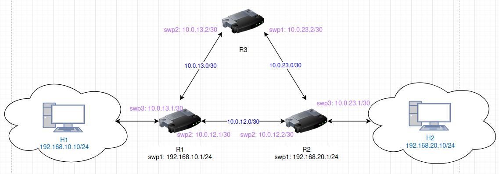

# Trinet Project

A simple network topology built with three **Cumulus VX** routers forming a triangular backbone and two hosts placed on separate LANs. The project demonstrates dynamic routing with **OSPF**, host connectivity across different LANs, and failover when backbone links go down.

## Topology



- **Routers**: R1, R2, R3 (Cumulus VX)
- **Hosts**: H1, H2 (Ubuntu 24.04)
- **Routing protocol**: OSPF

## Tools Used

- [Netlab](https://netlab.tools) – define, deploy, and configure labs
- **KVM + QEMU** – hypervisor and emulator for VMs
- **Vagrant** – VM provisioning
- **Libvirt** – virtualization management
- [Containerlab](https://containerlab.dev) – manage network labs
- **Ansible** – automated configuration management

## Setup

1. Create and activate a Python virtual environment:
   ```bash
   python3 -m venv trinet
   source trinet/bin/activate
   ```

2. Install dependencies:
   ```bash
   netlab install
   ```

3. Define the topology in `topology.yml`.
   This file describes the nodes, interfaces, addressing, and routing protocols.

4. Deploy the lab:

   ```bash
   netlab up
   ```

## Testing Connectivity

- Set the correct default gateway for hosts then verify hosts connectivity.
````
